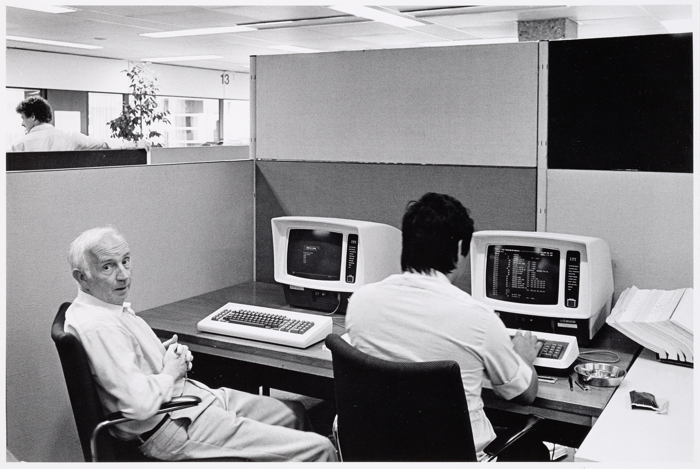

[Interpolis, servicecentrum](http://hdl.handle.net/10934/RM0001.COLLECT.346989) © René de Wit
{: .fs-1 .text-grey-dk-000 }

# Bibliographic data
The metadata of the [Rijksmuseum Research Library](https://library.rijksmuseum.nl) is avialable through two [APIs](./api).
