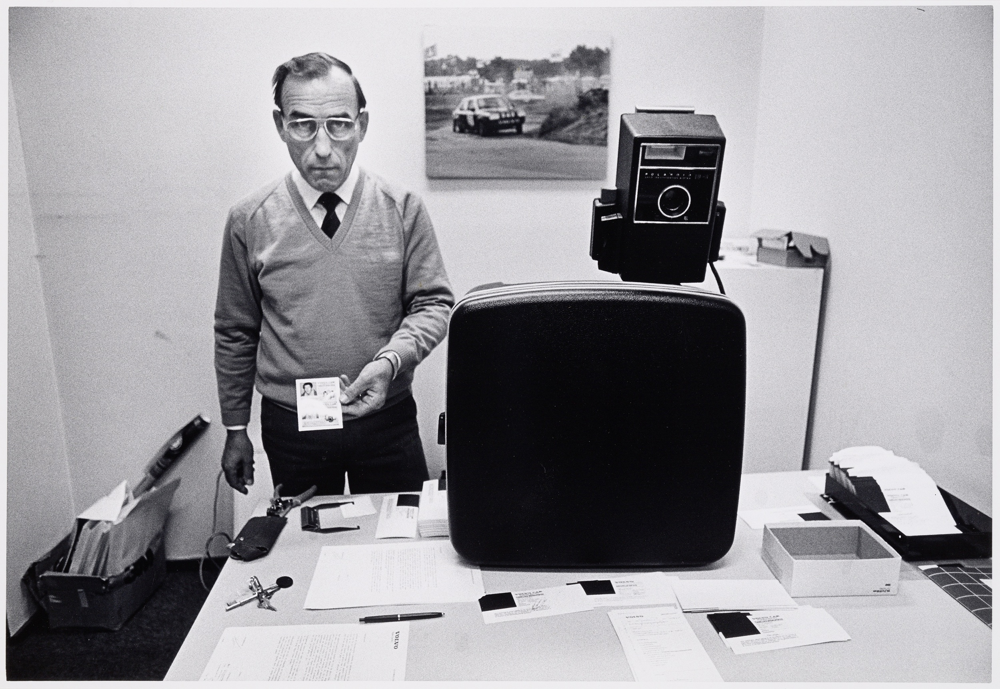

[Bezoekerspasjes bij Volvo](http://hdl.handle.net/10934/RM0001.COLLECT.347350) © Michel Pellanders
{: .fs-1 .text-grey-dk-000 }

# Controlled vocabularies
Controlled vocabularies contain data about actors, places, events and concepts. Controlled vocabularies of the Rijksmuseum are available as [downloads](./download).
