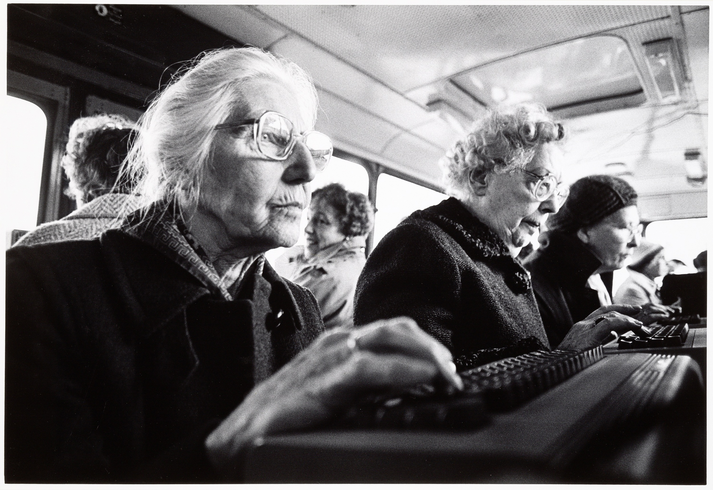

[Computerbus Heiloo](http://hdl.handle.net/10934/RM0001.COLLECT.347072) © Michel Pellanders
{: .fs-1 .text-grey-dk-000 }

# User-generated content
The Rijksmuseum provides access via [APIs](./api) to the [Rijksstudio sets](https://www.rijksmuseum.nl/en/rijksstudio) created by users.
